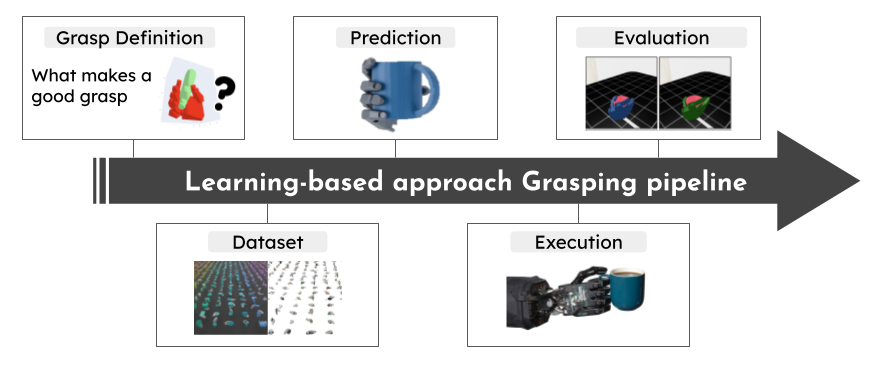

# Kunal Portfolio

A modern, interactive portfolio website showcasing research in robotics and reinforcement learning, featuring a dynamic Q-learning canvas background with interactive agents.



## 🚀 Quickstart

```bash
# Install dependencies
npm install

# Start development server
npm run dev

# Build for production
npm run build

# Preview production build
npm run preview
```

## 🏗️ Architecture Overview

### Tech Stack
- **Frontend**: React 18.3.1 + TypeScript
- **Build Tool**: Vite 5.4.8 (fast HMR, optimized builds)
- **Styling**: Tailwind CSS 3.4.13 + Custom glass morphism
- **Runtime**: Node.js >=18.0.0
- **Deployment**: GitHub Pages + GitHub Actions

### Project Structure
```
PersonalWebsite/
├── src/
│   ├── components/              # React components
│   │   ├── AgentGridRLBackground.tsx  # Interactive RL canvas
│   │   ├── Navbar.tsx           # Navigation header
│   │   ├── PublicationCard.tsx  # Research paper cards
│   │   ├── ProjectCard.tsx      # Project showcase cards
│   │   ├── EducationCard.tsx    # Education timeline
│   │   ├── ExperienceCard.tsx   # Work experience
│   │   ├── Section.tsx          # Reusable section wrapper
│   │   └── Footer.tsx           # Site footer
│   ├── data/
│   │   └── profile.ts           # Centralized content data
│   ├── App.tsx                  # Main application component
│   ├── main.tsx                 # React entry point
│   └── index.css                # Global styles + Tailwind imports
├── public/                      # Static assets
│   ├── amplify_vid.mp4          # AMPLIFY project video
│   ├── flash_vid.gif            # FLASH project video
│   ├── i2g2ro_vid.gif           # I2G2RO project video
│   ├── pressurevision++.mp4     # PressureVision project video
│   ├── survey_img.png           # Survey project image
│   ├── resume.pdf               # Downloadable resume
│   ├── favicon.svg              # Site icon
│   ├── logo.svg                 # Brand logo
│   └── CNAME                    # Custom domain config
├── package.json                 # Dependencies & scripts
├── vite.config.ts               # Vite build configuration
├── tailwind.config.js           # Tailwind customization
├── tsconfig.json               # TypeScript configuration
└── postcss.config.js           # PostCSS configuration
```

## 🎨 Design System

### Color Palette
```javascript
// Custom Tailwind theme
colors: {
  ink: {
    900: "#05070b",  // Darkest background
    800: "#090d14",  // Dark background
    700: "#0c111a",  // Medium dark
    600: "#111826"   // Light dark
  },
  neon: {
    cyan: "#7dd3fc",   // Accent cyan
    pink: "#f0abfc",   // Accent pink
    mint: "#99f6e4"    // Accent mint
  }
}
```

### Typography
- **Primary**: Inter (Google Fonts) - Clean, modern sans-serif
- **Monospace**: JetBrains Mono - Code and technical content
- **Responsive**: Fluid typography scaling with Tailwind breakpoints

### Glass Morphism Effects
```css
.glass {
  background: rgba(255, 255, 255, 0.04);
  backdrop-filter: blur(6px);
  border: 1px solid rgba(255,255,255,0.08);
  box-shadow: 0 0 0 1px rgba(255,255,255,0.03) inset;
}
```

## 🧠 Interactive RL Background

The portfolio features a sophisticated **Q-learning** animation system built with HTML5 Canvas:

### Technical Implementation
- **Algorithm**: Q-learning with epsilon-greedy exploration
- **State Space**: Grid-based navigation (nx × ny cells)
- **Actions**: 4-directional movement (up, right, down, left)
- **Reward Function**: +1.0 for reaching goal, -0.01 for time, -0.02 for walls
- **Learning Parameters**: α=0.22 (learning rate), γ=0.96 (discount), ε=0.20-0.45 (exploration)

### Interactive Controls
- **Click/Tap**: Spawn new RL agent at cursor position
- **R Key**: Toggle random-walk overlay
- **F Key**: Toggle flocking behavior
- **G Key**: Toggle goal marker visibility
- **Mouse Movement**: Subtle 3D canvas tilt effect

### Performance Features
- **Adaptive DPI**: Scales to device pixel ratio (1x-2.5x)
- **Responsive Grid**: Auto-adjusts cell count on window resize
- **Trail Management**: Limited trail history (70 points max per agent)
- **Optimized Rendering**: RequestAnimationFrame with 60fps target

## 📊 Content Management

### Centralized Data Structure
All content is managed in `src/data/profile.ts` with TypeScript interfaces:

```typescript
// Example data structure
export const profile = {
  name: "Kunal Aneja",
  tagline: "Research Engineer • RL • VLA • Robotics",
  publications: [
    {
      title: "I2G2RO: Image to Grasp to Reorient",
      authors: "Kunal Aneja, ..., Animesh Garg",
      venue: "Projected RSS 2026",
      year: "2026",
      image: "/i2g2ro_vid.gif",
      links: [
        { label: "Website", href: "https://github.com/pairlab/IsaacLab/" }
      ]
    }
  ],
  projects: [...],
  education: [...],
  skills: [...]
}
```

### Media Assets
- **Research Videos**: MP4 format with autoplay and loop (`amplify_vid.mp4`, `pressurevision++.mp4`)
- **GIFs**: High-quality animated demonstrations (`flash_vid.gif`, `i2g2ro_vid.gif`)
- **Images**: PNG/JPEG for diagrams and figures (`survey_img.png`)
- **PDFs**: Resume and supplementary documents (`resume.pdf`)

### Asset Naming Convention
All media files follow a standardized naming pattern:
- `{projectname}_vid.{ext}` - Project demonstration videos
- `{projectname}_img.{ext}` - Project diagrams and figures
- `resume.pdf` - Downloadable resume
- `favicon.svg`, `logo.svg` - Brand assets

## 🛠️ Development Workflow

### Local Development
```bash
# Install dependencies
npm install

# Start development server with hot reload
npm run dev
# → Opens http://localhost:5173

# Type checking
npx tsc --noEmit

# Lint code
npx eslint src/
```

### Content Updates
1. **Publications**: Edit `src/data/profile.ts` → `publications` array
2. **Projects**: Update `projects` array with new entries
3. **Media**: Add files to `public/` directory following naming convention
4. **Styling**: Modify `tailwind.config.js` or `src/index.css`

### Asset Management
- **Add New Media**: Follow `{projectname}_vid.{ext}` or `{projectname}_img.{ext}` pattern
- **Update References**: Modify image paths in `src/data/profile.ts`
- **Optimize Files**: Compress videos/GIFs for web delivery
- **Test Locally**: Verify all assets load correctly with `npm run dev`

### Build Process
```bash
# Production build (optimized)
npm run build
# → Generates dist/ folder with optimized assets

# Preview production build
npm run preview
# → Test production build locally
```

## 🚀 Deployment

### GitHub Pages (Recommended)
1. **Repository Setup**:
   ```bash
   git init
   git add .
   git commit -m "Initial commit"
   git remote add origin https://github.com/username/username.github.io.git
   git push -u origin main
   ```

2. **GitHub Actions**: 
   - Workflow automatically builds and deploys on push to `main`
   - Located in `.github/workflows/pages.yml`

3. **Custom Domain**:
   - Add `CNAME` file in `public/` directory
   - Configure DNS records (A record + CNAME for www)
   - Enable in GitHub Pages settings

### Alternative Hosting
- **Netlify**: Drag & drop `dist/` folder
- **Vercel**: Connect GitHub repository
- **AWS S3**: Upload `dist/` contents to S3 bucket

## 📱 Responsive Design

### Breakpoints
```css
/* Tailwind responsive classes */
sm: 640px   /* Small devices */
md: 768px   /* Medium devices */
lg: 1024px  /* Large devices */
xl: 1280px  /* Extra large devices */
```

### Mobile Optimization
- **Touch Interactions**: Tap to spawn agents on mobile
- **Performance**: Optimized canvas rendering for mobile GPUs
- **Typography**: Responsive font scaling
- **Navigation**: Collapsible mobile menu

## 🔧 Customization Guide

### Easy Modifications
1. **Personal Info**: Edit `src/data/profile.ts`
2. **Colors**: Modify `tailwind.config.js` color palette
3. **Fonts**: Update Google Fonts import in `index.html`
4. **Logo**: Replace `public/logo.svg`

### Advanced Customization
1. **RL Background**: Tune parameters in `AgentGridRLBackground.tsx`
   ```typescript
   const MAX_RIPPLE = 28;        // Ripple amplitude
   const AGENT_COUNT = 5;        // Number of agents
   const RL_STEPS = 1;          // Learning speed
   ```

2. **Animation Performance**: Adjust frame rate and complexity
3. **Component Styling**: Modify individual component files
4. **Build Configuration**: Update `vite.config.ts`

## 🎯 Performance Features

### Build Optimizations
- **Code Splitting**: Automatic route-based splitting
- **Tree Shaking**: Eliminates unused code
- **Asset Optimization**: Image/video compression
- **Bundle Analysis**: `npm run build -- --analyze`

### Runtime Performance
- **Lazy Loading**: Components loaded on demand
- **Canvas Optimization**: Efficient rendering with RAF
- **Memory Management**: Limited trail history and agent count
- **Responsive Images**: Optimized media delivery

## 🧪 Testing & Quality

### Code Quality
```bash
# Type checking
npx tsc --noEmit

# ESLint (if configured)
npx eslint src/

# Prettier formatting
npx prettier --write src/
```

### Browser Testing
- **Chrome/Edge**: Full feature support
- **Firefox**: Full feature support
- **Safari**: Full feature support
- **Mobile**: iOS Safari, Chrome Mobile

## 📚 Dependencies

### Production Dependencies
```json
{
  "react": "^18.3.1",
  "react-dom": "^18.3.1"
}
```

### Development Dependencies
```json
{
  "@types/react": "^18.3.3",
  "@types/react-dom": "^18.3.0",
  "@vitejs/plugin-react": "^4.3.3",
  "autoprefixer": "^10.4.20",
  "postcss": "^8.4.47",
  "tailwindcss": "^3.4.13",
  "typescript": "^5.6.2",
  "vite": "^5.4.8"
}
```

## 🤝 Contributing

1. Fork the repository
2. Create feature branch (`git checkout -b feature/amazing-feature`)
3. Commit changes (`git commit -m 'Add amazing feature'`)
4. Push to branch (`git push origin feature/amazing-feature`)
5. Open Pull Request

## 📄 License

This project is open source and available under the [MIT License](LICENSE).

## 🔗 Links

- **Live Site**: [kunalaneja.com](https://kunalaneja.com)
- **GitHub**: [github.com/Kunal2341](https://github.com/Kunal2341)
- **Research**: [PAIR Lab](https://www.pair.toronto.edu/)
- **LinkedIn**: [linkedin.com/in/kunal-aneja](https://www.linkedin.com/in/kunal-aneja/)
- **Google Scholar**: [scholar.google.com/citations?user=Faop3qAAAAAJ](https://scholar.google.com/citations?user=Faop3qAAAAAJ&hl=en)

## 📋 Recent Updates

- ✅ **Website Title**: Updated to "Kunal Portfolio"
- ✅ **Asset Organization**: Standardized naming convention (`projname_vid/img`)
- ✅ **RL Background**: Enhanced with smooth goal movement, collision detection, and advanced reward systems
- ✅ **Research Content**: Added latest publications (AMPLIFY, FLASH, PressureVision++, Survey)
- ✅ **Interactive Features**: Click-to-spawn agents, keyboard controls, info modal, pause functionality
- ✅ **Video Format**: Updated PressureVision to MP4 format for better quality and compression
- ✅ **UI Improvements**: Fixed duplicate labels, enhanced button styling, improved modal design

---

*Built with ❤️ using React, TypeScript, and Tailwind CSS*